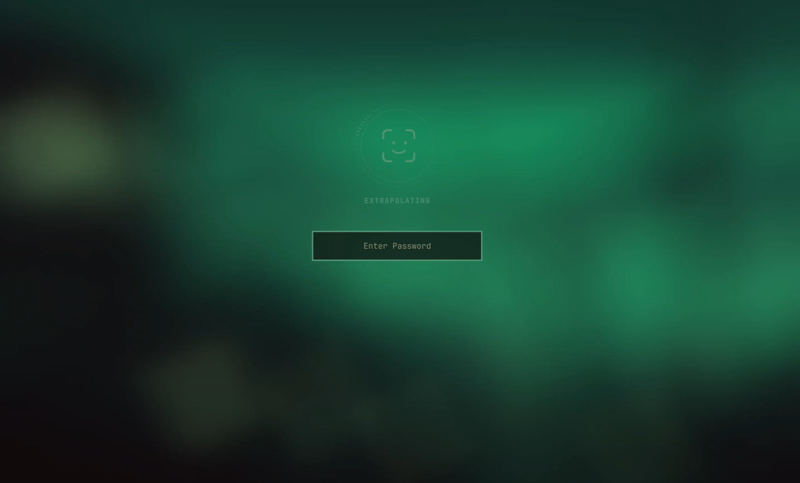

# Omarchy Face ID

## Unlock Omarchy with a glance.

Omarchy Face ID brings fast, private facial authentication to Omarchy. Look at the camera to unlock your computer or approve a terminal command. Face matching and liveness checks happen locally. Camera footage is never saved. Your password continues to work too.



## Install

[Download Omarchy Face ID 0.7.2](https://github.com/fitzzz/omarchy-face-id/releases/download/v0.7.2/Omarchy_Face_ID-0.7.2-x86_64.AppImage), make it executable, and open it:

```bash
chmod +x ~/Downloads/Omarchy_Face_ID-0.7.2-x86_64.AppImage
~/Downloads/Omarchy_Face_ID-0.7.2-x86_64.AppImage
```

The guided setup checks your camera, installs anything Omarchy needs, and captures five quick angles of your face. When the scan is complete, Face ID is ready.

Lock your computer and look directly at the camera. Face ID appears after three seconds, confirms it is really you, and unlocks Omarchy.

When `sudo` needs approval in a terminal, Face ID pauses before opening the camera and asks you to choose. **Approve with Face ID** keeps the same window open while it scans, then confirms **Approved.** before the command continues. **Decline** cancels the command. You can also press `A` or `D` after the 1.5-second safety delay. If the camera or desktop overlay is unavailable, the unchanged password stack remains available as a safe fallback.

## Upgrade

Download and open the newest AppImage. Existing installations are recognized automatically. The wizard updates Face ID in place, adds new integrations, and keeps the saved face scan—there is no uninstall and no rescan.

To update an existing installation without opening the wizard, run:

```bash
./Omarchy_Face_ID-x86_64.AppImage --upgrade-quietly
```

The command prints each phase in the terminal and still requests normal administrator approval when protected system files need to change. It refuses to run before Face ID has been set up.

## Designed to disappear

- **Private by design.** Face matching, liveness checks, and biometric storage stay on your computer.
- **Hard to fool.** Liveness protection is designed to reject flat photographs instead of accepting any matching image.
- **Always familiar.** Face ID works with the existing Omarchy lock screen and follows the active theme.
- **Quiet when you leave.** It waits before scanning, sleeps when nobody is there, and wakes when it detects movement.
- **Your password stays.** Face ID adds a faster way in. It never removes or replaces password unlock.

## What you will see

The lock-screen indicator follows a simple rhythm:

1. **Standby** when nobody is present.
2. A subtle animated scan when you return.
3. **Locked** when a face cannot be verified.
4. A checkmark when Omarchy is unlocked.

A short sound confirms a successful face scan and unlock. Every failure is soft: if the camera, Face ID, or an Omarchy integration is unavailable, the password screen keeps working.

## Make it yours

Lock-screen behavior lives in:

```text
~/.config/omarchy-face-id/config.toml
```

Low-power presence detection is enabled by default. The app creates the configuration once, preserves your changes during upgrades, and reloads them automatically. See [Configuration](docs/configuration.md) for every option.

## Privacy and diagnostics

Omarchy Face ID never logs camera images, face templates, biometric data, usernames, device paths, or passwords.

When something goes wrong, privacy-safe diagnostics are written to:

```text
~/.local/state/omarchy-face-id/diagnostics.jsonl
```

Attach that file to a bug report. It records setup and authentication states, camera capabilities, and sanitized outcomes without recording who you are or what the camera saw. See [Diagnostics](docs/diagnostics.md) for the event format.

## Uninstall

Run the AppImage as your normal user:

```bash
~/Downloads/Omarchy_Face_ID-0.7.2-x86_64.AppImage --uninstall
```

Uninstall removes Omarchy Face ID, its lock-screen integration, and the saved face scan. It removes Gaze and camera support only when its root-owned receipts prove that Omarchy Face ID installed them. Software that was already present is left alone. Your password is unchanged.

## How it works

Omarchy Face ID is a standalone setup app with a small, lock-screen-only Omarchy subscriber. The subscriber never handles terminal approvals, and the product itself is not an Omarchy plugin.

[Gaze](https://github.com/GunduLabs/gaze) owns enrollment, local face matching, liveness detection, and biometric storage. The setup app installs the official `gaze-bin` package through Omarchy's standard AUR workflow when needed. Missing JPEG camera support is installed through the official `gst-plugins-good` Arch package. Neither dependency is downloaded, forked, or privately redistributed by this project.

The official Gaze package initially adds broad sudo and Polkit authentication rules. Omarchy Face ID replaces the direct sudo rule with one stable include for its own dedicated PAM configuration. A local interactive sudo request launches a short-lived standalone approval window through a private request channel; the Omarchy lock-screen subscriber is not involved. One trusted coordinator keeps that window open from the decision through face verification and success. Gaze runs through a separate root-owned face-only PAM configuration with no access to the terminal, so its internal prompts cannot appear beside the sudo command. Declining cancels the request, while a camera, prompt, or Gaze failure leaves the existing password stack available. When Face ID installed Gaze, setup also removes Gaze from Polkit prompts so the final setup authorization cannot dismiss itself. For pre-existing Gaze installations, unrelated PAM configuration remains untouched and the original sudo rule is restored on uninstall.

For exclusive V4L2 and infrared cameras, the app displays preview frames supplied by Gaze. For a shareable PipeWire RGB camera, it opens a second display-only PipeWire stream after Gaze owns enrollment. The app never uses Qt Multimedia or direct V4L2 capture for its preview.

If a future Omarchy update changes the internal lock interface, Face ID stops and leaves password unlock available. A supported Omarchy biometric-provider API remains the preferred long-term integration.

## Build from source

Requirements: CMake 3.24 or newer, Ninja, pkg-config, GStreamer 1.0 with its app library and PipeWire plugin, a C++20 compiler, and Qt 6.7 or newer with Core, DBus, Gui, Quick, and Quick Controls 2.

```bash
cmake -S . -B build-native -G Ninja -DCMAKE_BUILD_TYPE=Debug
cmake --build build-native
ctest --test-dir build-native --output-on-failure
./build-native/omarchy-face-id
```

Build the AppImage with:

```bash
./scripts/build-appimage.sh
```

Every release uses the semantic version in [`VERSION`](VERSION). Update it and move completed entries from **Unreleased** into a dated section in [`CHANGELOG.md`](CHANGELOG.md) before distributing a build. The executable, plugin manifest, AppImage metadata, and versioned filename are checked against that release version during packaging.

The AppImage intentionally uses the Qt 6 libraries already supplied by Omarchy. Bundling a second rolling-release Qt and multimedia stack caused loader conflicts during testing.

## Project status

Omarchy Face ID is an early release for x86-64 Omarchy systems. The current compatibility layer checks for Omarchy's lock service at runtime and draws a separate, non-interactive Hyprland layer above it. It never patches the password field.

Project code is GPL-3.0-or-later. The Lucide-derived eye geometry and CC0 MLaudio completion sound are covered by [THIRD_PARTY_NOTICES.md](THIRD_PARTY_NOTICES.md). The original design direction is recorded in [the initial build plan](docs/2026-08-28-initial-build.md).
